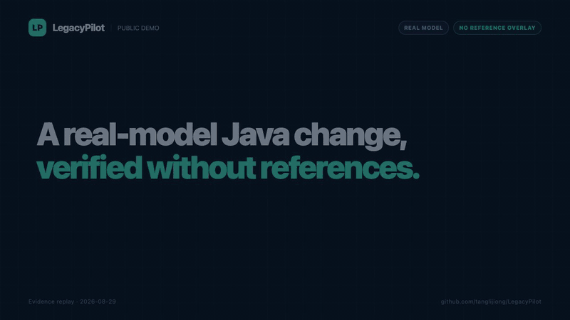

# LegacyPilot

> Enterprise Agent Harness for Java legacy systems.

LegacyPilot 是一个面向企业存量 Java 系统的开源智能研发 Agent。它接收需求或缺陷描述，在隔离的 Git worktree 中完成代码检索、影响分析、变更规划、受控修改、测试生成、Maven 验证与风险报告。

项目目标不是再做一个“把整个代码库塞进 Prompt”的演示，而是实现一个可控制、可观测、可评测、可验证的 **Single Agent + Strong Harness**。

## MVP 演示目标

输入需求：

> 转账接口新增每日累计限额。普通用户每天不得超过 5 万元，VIP 用户不得超过 20 万元，超过限额返回错误码 `TRANSFER_LIMIT_EXCEEDED`。

LegacyPilot 应能自动完成：

```text
导入 Java 项目
  -> 构建代码索引与依赖关系
  -> 生成影响分析和变更计划
  -> 人工批准高风险操作
  -> 在隔离 worktree 中修改代码
  -> 生成或补充单元测试
  -> 执行 compile / test / static analysis
  -> 失败后按预算重试
  -> 输出可审计的验证报告
```

当前确定性 Replay Agent 验收结果：

```text
Result: SUCCESS
Files modified: 4
Banking tests: PASS (standard / VIP / over-limit / UTC rollover / concurrency)
Compilation: PASS
Deterministic assertions: PASS
Risk: LOW
Token / Cost / Duration: recorded
```

## 公开演示



这段 41 秒演示回放真实 GPT-5.4 运行 `task-005` 的证据：模型未获得 reference solution，也未使用 reference overlay；它在隔离工作区修改生产代码，5 项公开断言全部通过，独立 Maven 测试通过。另见 [MP4](docs/assets/demo/legacy-pilot-task-005-real-model.mp4) 和[证据说明](docs/PUBLIC_DEMO.md)。

## 核心能力

- 自研 Agent Runtime：Plan → Act → Observe → Verify → Retry
- Java 代码上下文引擎：AST + BM25 + Vector + Dependency Graph
- 受控工具调用：文件系统、Git、Maven、代码搜索与补丁应用
- Docker / Git worktree 隔离执行与命令白名单
- Human-in-the-loop 审批和风险分级
- 版本化 Policy DSL 与短期最小权限 Capability Grant
- MCP Server：将 Java 项目、受权补丁与 Maven 能力开放给兼容客户端
- 多模型有限 Fallback、Provider 熔断与路由证据
- Revision-scoped Vector Store、Reranker 与显式降级
- Trace、Token、Cost、Duration 等运行观测
- 版本化 Checkpoint、Action Journal、Run Lease 和跨进程安全恢复
- 可重复运行的 Eval 数据集与成功率基准

## 技术方向

- Java 21、Spring Boot、Spring AI
- JavaParser、Lucene/BM25、可插拔向量存储
- Maven、JUnit、JaCoCo、SpotBugs/Checkstyle
- Docker、PostgreSQL/pgvector（按阶段启用）
- Micrometer、OpenTelemetry
- React Dashboard（v0.3）

项目采用 Java 优先的模块化单体设计。v0.1 先完成可运行的端到端闭环，避免在验证价值前引入多 Agent、Kubernetes、IDE 插件或模型微调。

## 规划文档

- [文档导航](docs/README.md)
- [产品需求文档（PRD）](docs/PRD.md)
- [技术架构](docs/ARCHITECTURE.md)
- [仓库结构](docs/REPOSITORY_STRUCTURE.md)
- [路线图](docs/ROADMAP.md)
- [MVP Backlog：20 个 GitHub Issues](docs/MVP_BACKLOG.md)
- [架构决策记录](docs/DECISIONS.md)
- [已完成长期任务：Issue 02–04](docs/NEXT_TASK.md)
- [已完成长期任务：Issue 05、10、11](docs/NEXT_TASK_ISSUES_05_10_11.md)
- [已完成长期任务：Issue 06–09](docs/NEXT_TASK_ISSUES_06_09.md)
- [已完成长期任务：Issue 12–16](docs/NEXT_TASK_ISSUES_12_16.md)
- [Issue 17–20 工程验收与发布待办](docs/NEXT_TASK_ISSUES_17_20.md)
- [已完成长期任务：Issues 21–26 可恢复 Harness](docs/NEXT_TASK_ISSUES_21_26.md)
- [已完成长期任务：Issues 27–32 受治理工具链与模型韧性](docs/NEXT_TASK_ISSUES_27_32.md)
- [下一阶段长期任务：v0.2 收口与证据优先的精简 v0.3](docs/NEXT_LONG_RUNNING_TASK_V0_2_V0_3.md)
- [可恢复 Harness 运维指南](docs/RESILIENT_HARNESS.md)
- [受治理 Harness 指南](docs/GOVERNED_HARNESS.md)
- [30 分钟 Quickstart](docs/QUICKSTART.md)
- [MCP Server](docs/MCP_SERVER.md)
- [Eval Harness 与公开基线](docs/EVALS.md)
- [公开演示证据](docs/PUBLIC_DEMO.md)

## 当前状态

v0.1.0 发布证据已完成：系统具备 Java 代码智能、受控工具、Agent Loop、审批验证、可授权写入的 STDIO MCP、可运行 Banking Demo、五任务 Eval、可恢复长任务，以及 Policy/Capability、多模型路由、revision-scoped Vector/Reranker 和 Docker 依赖治理。真实模型五任务基线、无 reference overlay 的公开演示、全新环境 smoke、真实 Docker 测试及远端工作流结果见[发布清单](docs/RELEASE_CHECKLIST_V0.1.md)。

## 本地开发

要求 JDK 21 或更高版本。项目自带 Maven Wrapper：

```bash
./mvnw verify
```

提交代码前可自动应用格式：

```bash
./mvnw spotless:apply
```

完整构建会执行单元测试、架构边界测试、格式检查、Checkstyle、SpotBugs 和 JaCoCo 覆盖率检查。贡献约定见 [CONTRIBUTING.md](CONTRIBUTING.md)，安全问题请按 [SECURITY.md](SECURITY.md) 私下报告。

### 运行 REST 服务

```bash
./mvnw -pl apps/server -am spring-boot:run
```

启动后可访问 OpenAPI UI：`http://localhost:8080/docs`。生命周期 API 位于 `/api/v1`。

### 运行 CLI

```bash
./mvnw -pl apps/cli -am package
java -jar apps/cli/target/legacy-pilot-cli-0.2.0.jar --help
```

CLI 还支持 `agent-approve`、`agent-resume`、`agent-state-check`、`agent-recover`、`capability-issue`、`capability-revoke` 和五任务 `eval-run`。默认数据和受管 worktree 位于当前目录的 `.legacy-pilot/`；可分别通过 `LEGACY_PILOT_DATA_DIR`、`LEGACY_PILOT_WORK_ROOT` 与 `LEGACY_PILOT_AGENT_STATE_ROOT` 调整。

本地项目注册会拒绝 dirty 仓库、submodule 和 Git LFS；远程注册仅接受不带凭证的公开 HTTP(S) Git URL。

## 明确不做

v0.1 不做多 Agent、COBOL 到 Java 自动转换、Kubernetes、IDE 插件、Jira/Jenkins 集成和模型微调。它们只有在核心闭环达到可量化的稳定性后才会进入后续版本。

## License

本项目使用 [Apache License 2.0](LICENSE)。
